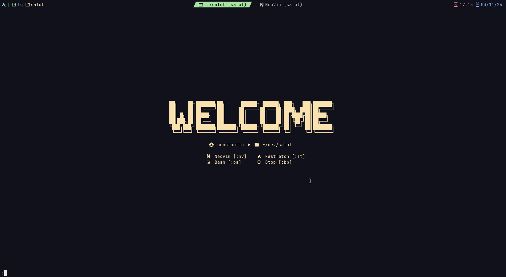

# Salut
## A beautiful terminal greeter 🌸

Salut is a simple yet beautiful terminal greeter.   
To use it, simply attach the path of the salut binary to the top of your shell config file.
Salut will then launch, everytime you open your shell.

<div align="center">

</div>

### Installation
Salut does not come pre-built for any distributions.   
You have to build it your self.

1. Clone this repository
```bash
git clone https://github.com/Wervice/salut
```
2. Compile and run the source code
- a) Using GCC
```bash
g++ -o salut main.cpp -lfmt && ./salut
```
- b) Using Clang
```bash
clang++ -o salut main.cpp -lfmt && ./salut
```
- c) If you are on NixOS
```bash
nix-shell
```

3. Copy the executable somewhere else
I recommend moving the executable into a folder in your `$PATH`, but you can choose any location you like.
4. Add `salut` binary path to your config file
Depending on your shell, your config file may be called:
- `.zshrc`
- `.bashrc`
5. Salut will now launch every time you open a new shell

### Usage
To keep salut open, you need to press `:` one time, before you can do anything.
If you do not press `:`, the splash screen will instantly close at the first key press and leave your default shell.
Salut uses a command line at the bottom of your terminal for inputs. You do not need to enter the `:` when writing commands.
You run the programs in the list by entering their corresponding command.
By default the following commands are implemented:
|Command|Action|
|-------|------|
|`q`    |Exits salut|
|`h`    |Shows help|
|`main` |Returns to main screen|
|`nv`   |Opens neovim|
|`ft `  |Opens fastfetch|
|`bs`   |Starts bash|
|`bp`   |Opens btop|

### Configuration
Salut does not feature a config file. Thus, you have to edit the source code to modify `salut`.
To set your own applications, edit the `options` variable in `int main`.
You can change the `prefix` char using the prefix variable.

```cpp
vector<tuple<string, string, string, string>> options = {
      make_tuple("Neovim", " ", "nv", "nvim"),
      make_tuple("Fastfetch", " ", "ft", "fastfetch"),
      make_tuple("Bash", " ", "bs", "bash"),
      make_tuple("Btop", " ", "bp", "btop"),
  };
```
Just copy-'n-paste a line and edit it to create a new link.

Please note, that `salut` will not display links or ascii art if the terminal is to small.

#### Flags
- `--quick-tap`  
  When enabled, salut will only listen to one key press before quitting. This way, you can skip the prefix and press a key to immediately launch any command you want.

### The name
The name of `salut` comes from the french "salut", which means "Hi".
It is pronouced without the t in the end.
